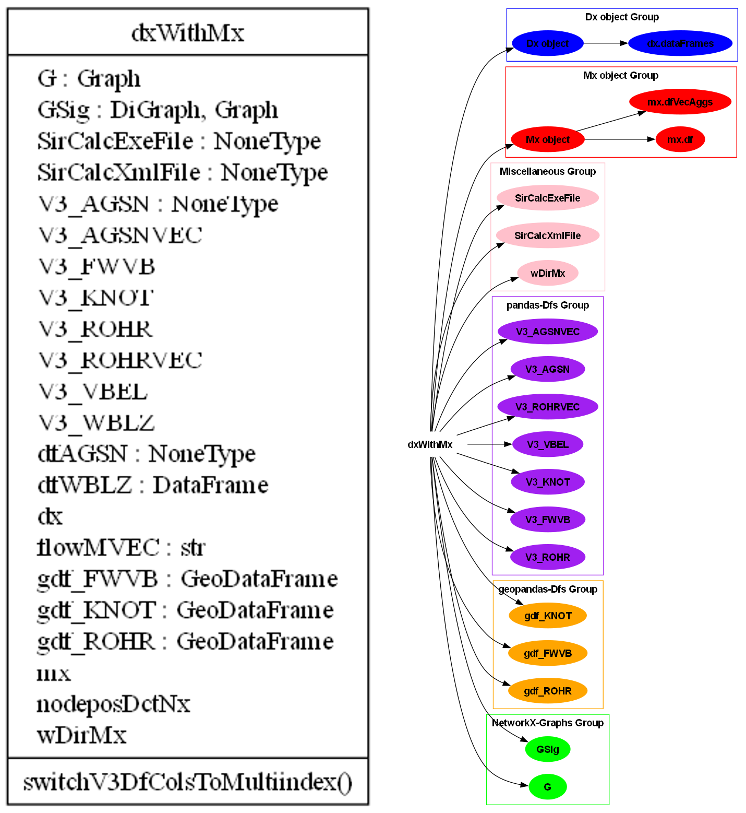

Classes and Objects
================================

.. note:: This page is still Work in Progress.

Welcome to the Classes and Objects page! Here, we will delve into the differnt classes and objects and their relationship.

.. note::
    Currently, not all Objects that exist in PT3S are documented. These will be added in the future.

.. testsetup::

    import os
    import geopandas
    import logging
    import pandas as pd
    import io
    import subprocess
    from PIL import Image

    import folium
    from folium.plugins import HeatMap

    try:
        from PT3S import dxAndMxHelperFcts
    except:
        import dxAndMxHelperFcts
    dbFilename="Example1"
    dbFile=os.path.join(os.path.dirname(os.path.abspath(dxAndMxHelperFcts.__file__))
                    +'/Examples/'
                    +dbFilename
                    +'.db3')
    m=dxAndMxHelperFcts.readDxAndMx(dbFile=dbFile                                 
                                ,preventPklDump=True
    )

m Object
--------
The m object or dxWithMx object is a wrapper for Dx with attached Mx and the center piece in working with PT3S. It is created by :ref:`readDxAndMx-label`

.. autofunction:: dxAndMxHelperFcts.dxWithMx.__init__

|

.. raw:: html

   <iframe src="C:\\Users\\jablonski\\3S\\PT3S\\sphinx_docs\\uml\\interactive_diagram.html" width="100%" height="600"></iframe>

Dataframes
~~~~~~~~~~

From the object m, you can access a variety of dataframes created by PT3S based on the model and results

.. doctest::
    
    >>> print([attr for attr in dir(m) if isinstance(getattr(m, attr), pd.DataFrame)])    
    ['V3_AGSN', 'V3_AGSNVEC', 'V3_FWVB', 'V3_KNOT', 'V3_ROHR', 'V3_ROHRVEC', 'V3_VBEL', 'V3_WBLZ', 'dfAGSN', 'dfWBLZ', 'gdf_FWVB', 'gdf_KNOT', 'gdf_ROHR']

The following section presents these dataframes by functions that create these dataframes.

V3_ROHR
"""""""
.. autofunction:: dxAndMxHelperFcts.dxWithMx._V3_ROHR
.. doctest::
    
    >>> m.V3_ROHR.head()
                        pk                 fkDE  ...    PHRAbs     JVAbs
    0  5442010239090746007  5306805303452857793  ...  0.010414  0.285856
    1  4917786378639043296  5306805303452857793  ...  0.014643  0.255914
    2  4762482310382009633  5306805303452857793  ...  0.010845  0.264538
    3  4987229536643024523  5306805303452857793  ...  0.001804  0.264079
    4  5722206630503885118  5306805303452857793  ...  0.001979  0.264080

V3_KNOT
"""""""
.. autofunction:: dxAndMxHelperFcts.dxWithMx._V3_KNOT
.. doctest::
    
    >>> m.V3_KNOT.head()
                        pk                 fkDE  ...   QM       dPH
    3  5669301360686511351  5306805303452857793  ...  0.0  1.488921
    4  5397948523091900401  5306805303452857793  ...  0.0  1.467910
    5  5239335112004772156  5306805303452857793  ...  0.0  1.444288
    6  5298886695042021307  5306805303452857793  ...  0.0  1.434558
    7  4993257270457791438  5306805303452857793  ...  0.0  1.432193

V3_VBEL
"""""""
.. autofunction:: dxAndMxHelperFcts.dxWithMx._V3_VBEL
.. doctest::
    
    >>> m.V3_VBEL.head()
                                                  pk  ...       mlc_k
    OBJTYPE OBJID                                     ...            
    FWES    5194722485643852853  5194722485643852853  ...  577.049723
            5393031835236689087  5393031835236689087  ...  593.013845
    FWVB    4611752310942477664  4611752310942477664  ...  574.339884
            4612528660388965271  4612528660388965271  ...  551.357794
            4612562908060328263  4612562908060328263  ...  574.527331

V3_AGSN
"""""""
.. autofunction:: dxAndMxHelperFcts.dxWithMx._V3_AGSN
.. doctest::
    
    >>> m.V3_AGSN.head()
      Pos  ... ('TMAX', 'mlc', Timestamp('2023-02-12 23:00:00'), Timestamp('2023-02-13 23:00:00'))_n
    0  -1  ...                                          602.48758                                   
    0   0  ...                                          602.48758                                   
    1   1  ...                                         602.419501                                   
    2   2  ...                                         602.385399                                   
    3   3  ...    
                                         602.306951
V3_ROHRVEC
""""""""""
.. autofunction:: dxAndMxHelperFcts.dxWithMx._V3_ROHRVEC
.. doctest::
    
    >>> m.V3_ROHRVEC.head()
                        pk  ... (TMAX, tMVEC, 2023-02-12 23:00:00, 2023-02-13 23:00:00)
    0  5442010239090746007  ...                                          98.646645     
    1  5442010239090746007  ...                                          98.646645     
    2  4917786378639043296  ...                                          55.044947     
    3  4917786378639043296  ...                                          55.044947     
    4  4762482310382009633  ...                                          56.352818  

V3_AGSNVEC
""""""""""
.. autofunction:: dxAndMxHelperFcts.dxWithMx._V3_AGSNVEC
.. doctest::
    
    >>> m.V3_AGSNVEC.head()
      Pos                   pk  ...      QM_min      QM_max
    0   0  5755933101669454049  ...  287.090085  538.206592
    1   0  5755933101669454049  ...  287.090085  538.206592
    2   1  5755933101669454049  ...  287.090085  538.206592
    3   2  5755933101669454049  ... -538.206592 -287.090085
    4   3  5755933101669454049  ... -538.206592 -287.090085

GeoDataframes
"""""""""""""

.. autofunction:: dxAndMxHelperFcts.dxWithMx._gdfs

Graphs
~~~~~~~~~~

G
"""""""
.. autofunction:: dxAndMxHelperFcts.dxWithMx._G

GSig
"""""""
.. autofunction:: dxAndMxHelperFcts.dxWithMx._GSig    

Dx object
---------

Dataframes
~~~~~~~~~~

.. note::
    Currently, by far not all dfs that are attributes of a Dx object are documented. Maybe this will be added in the future.
    V3-VBEL, _KNOT, _ROHR and _FWVB are dx attributes.
    The corresponding m attributes (V3-VBEL, _KNOT, _ROHR and _FWVB) extend the dx dfs with result columns.

dfLAYR
""""""
.. autofunction:: Dx.Dx._dfLAYR

Mx object
---------   
 